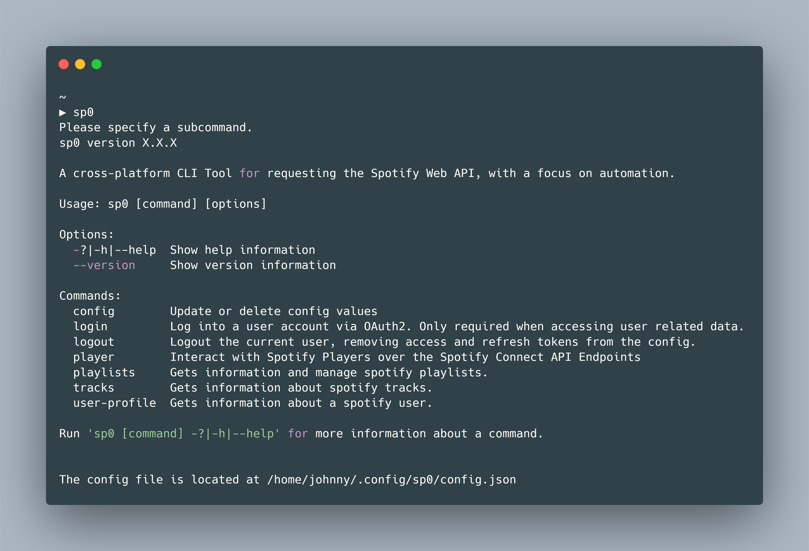
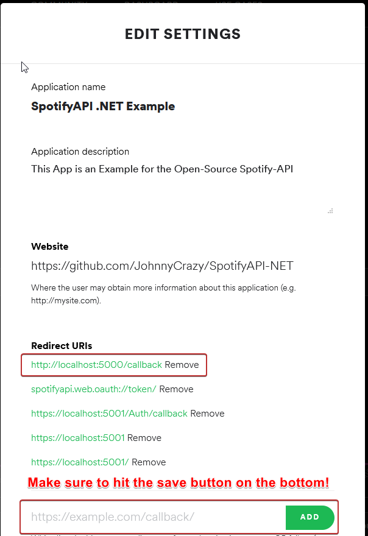

# Sp0


A simple CLI tool for interacting with the Spotify Web API with a strong focus on automation, written in .NET/C#. Under the hood, it's just a wrapper for supplying args to [SpotifyAPI-NET](https://github.com/JohnnyCrazy/SpotifyAPI-NET/).



## Features

* ✅ Cross Platform for linux, mac and windows (Binary releases only support `x64` architecture!)
* ✅ Easy OAuth2 login via embedded Webserver
* ✅ Commands for retriving and managing the player, tracks, playlists and more
* ✅ Different output formats (`json`, `id`, `uri`) for piping into other tools (`jq`)
* ✅ Included Retry Handling and Pagination support

## Getting Started

To get started, install `sp0` by following one of the steps below:

* Arch Users can get it via the AUR Package [`sp0-bin`](https://aur.archlinux.org/packages/sp0-bin/)
  ```bash
  yay -S sp0-bin
  ```
* Prebuild binaries can be grabbed from the [latest Github Release](https://github.com/johnnycrazy/sp0/releases)
  ```bash
  # Assume sp0-linux-x64 is in the cwd
  chmod +x sp0-linux-x64
  sudo mv sp0-linux-x64 /usr/bin/sp0
  ```
* TODO: Windows WinGet Version

After installation, the minimal setup requires spotify app credentials. You can create a new application [here](https://developer.spotify.com/dashboard/applications). The required parameters are `Client ID` and `Client Secret`.

```bash
sp0 config --client-id YOUR_CLIENT_ID --client-secret YOUR_CLIENT_SECRET
sp0 tracks 3Ve0ag71EeiQalsl7Ha4Dw | jq ".name"
# "Ausgehen"
```

This configuration does not allow to manage and access user related endpoints, like the player and modifying user playlists. For this to work, you'll need to add `http://localhost:5000/callback` to the redirect URLs of your spotify application.



Afterwards, login via `sp0 login` and follow the instructions.

## File Size & Exectution Notes

As you may have noted, the binary size of ~26MB is higher than usual form similar CLI Tools. This is because the binary includes the full .NET environment in a compressed form, accomplished by [dotnet-warp](https://github.com/Hubert-Rybak/dotnet-warp).

On first start, it will extract application DLLs and the .NET environment to a specific folder, based on your operating system:

* Linux: $HOME/.local/share/warp/packages
* macOS: $HOME/Library/Application Support/warp/packges
* Windows: %LOCALAPPDATA%\warp\packages

While this may sound bad to you, it has multiple advantages
* No runtime dependencies
* No breaking through new .NET versions
* Single file instead of 80 DLLs

If you're not comfortable with this process but still would like to use this project, feel free to build it on your own and use the resulting DLLs in `/bin/Release/netcorerapp3.1/linux-x64` after running `dotnet publis -c Release`.
